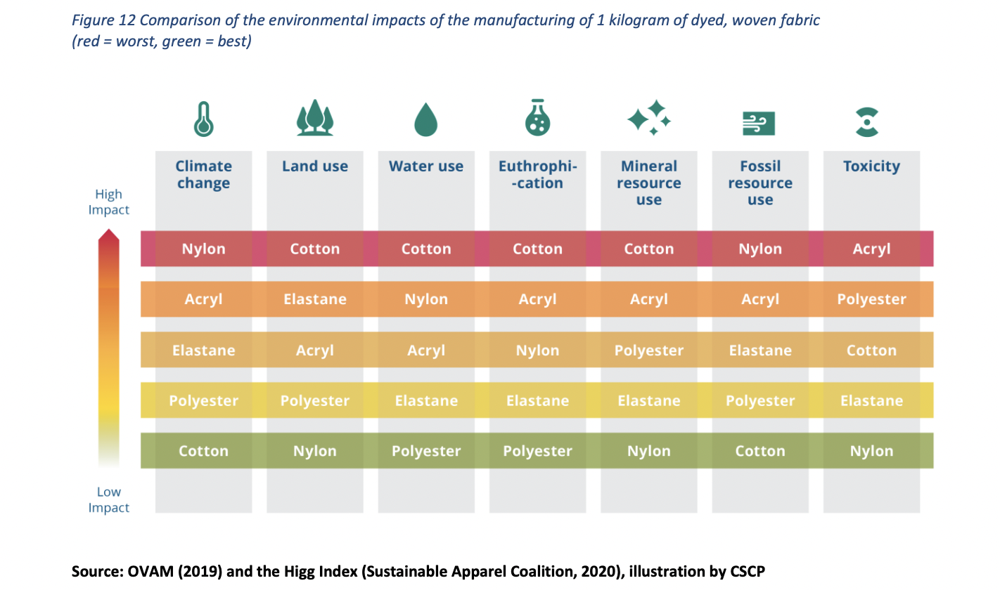

# Project of Data Visualization (COM-480)

|  Student's name  | SCIPER |
| ---------------- | ------ |
| Julie Korber | 300467 |
| Clara Tavernier | 302586 |
| Louise Font | 301847 |

[Milestone 1](#milestone-1) • [Milestone 2](#milestone-2) • [Milestone 3](#milestone-3)

## Milestone 1 (29th March, 5pm)

### Dataset

> Unfortunately, most of the information that we find important on the subject has not been brought together in datasets available to the general public. On the other hand, numerous government or NGO reports are made public, as well as published scientific articles on the subject. We will therefore create some of our datasets from the figures and information we find there.
>
> **Dataset 1:**
> 
> In order to introduce the subject of pollution in a general way, we will start by showing how the average carbon footprint of a person living in Switzerland is distributed using “carbon-footprint.xlsx” and “actions.xlsx” datasets from the affiliated with UNIL and EPFL center CLIMACT. (Datasets recoverable [here](https://climpact.ch/about).)
>
> **Dataset 2:**
> 
> To show the impact on different ways (water use, pollutants emitted, greenhouse gas emissions…) from different fabrics, we will use the following dataset: [Plastic based Textiles in clothing industry](https://www.kaggle.com/datasets/purohitgaurav/plastic-based-textiles-in-clothing-industry). 
>
> **Dataset 3 (need to be created from article):**
> 
> The dataset 2 is only on plastic based textiles, i.e synthetic fibers. To also compare them with natural fibers, we will use the article [Carbon Footprint of Textile and Clothing Products](https://www.researchgate.net/publication/276193965_Carbon_Footprint_of_Textile_and_Clothing_Products) where we can find the energy Consumption and CO2 emissions of different natural and synthetic fibers clothing.
>
> **Datasets 4:**
> 
> These are multiple simple dataset on the four main consumptions of textile industry in a global way
> Accessibles from the website *Our World in Data*:
> - [CO₂ and Greenhouse Gas Emissions](https://ourworldindata.org/co2-and-greenhouse-gas-emissions)
> - [Water use](https://ourworldindata.org/water-use-stress)
> - [Energy](https://ourworldindata.org/energy)
> - [Land use](https://ourworldindata.org/land-use)

### Problematic

> Following the latest IPCC report, the inevitable consequences of climate change have once again been highlighted. Rising greenhouse gas emissions, ocean acidification and water pollution are having an undeniable impact on our environment. When confronted with this information, the public's first point of attack is often transport. Indeed, the political battle against the use of combustion engine cars and the work of environmental movements to promote rail travel over air travel highlight the primary impact of this sector on global warming. However, this leaves other major players behind such as the fashion industry. Our inclination to regularly change our wardrobe is responsible for 8-10% of global greenhouse gas emissions. Cotton production uses 2.5% of agricultural land, and synthetic materials consume 342 million barrels of oil every year and dyes 42 million tonnes of chemicals. This does not take into account water consumption, which is 2,700 litres for a T-shirt and 10,000 for a pair of jeans. On top of this, the industry poses an ethical problem, whether through forced child labour, deplorable living wages or dangerous working conditions. 
>
> With an average of £600 spent on clothes each year in Europe, the over-consumption encouraged by fast fashion is having a disastrous impact. Through this project, we want to show the public the real cost of their clothes and encourage them to think more carefully before buying their next jumper from a major brand. By making it easier to visualise, we hope that readers will be genuinely affected by this problem and will share this information with others in order to reduce the problem as a whole. In our case, our audience would be mainly young, as this is the age group that is also targeted by the advertising produced by the extra fast and fast fashion industry. 
>
> Sources : 
> - https://www.bbc.com/news/science-environment-60382624
> - https://www.weforum.org/agenda/2019/01/by-the-numbers-the-economic-social-and-environmental-impacts-of-fast-fashion/

### Exploratory Data Analysis

> You can find the pre-processing in the two notebooks in the repository:
> - `Consumptions-dataset-exploration.ipynb`: Datasets 1 & 4
> - `Textile-dataset-exploration.ipynb`: Datasets 2 & 3 (and an extra dataset that we don't think we will use)

### Related work

- What others have already done with the data?
> There are numerous papers, reports and websites discussing the environmental impact of fast-fashion brands. Here are some examples: 
> - The website mentioned in dataset 4 section. 
> - [This report](https://www.eionet.europa.eu/etcs/etc-wmge/products/etc-wmge-reports/plastic-in-textiles-potentials-for-circularity-and-reduced-environmental-and-climate-impacts) adressing the presence of plastic in textiles. It provides an overview of the current data on the production and consumption of synthetic polymers in Europe. It also provides insights into the environmental impacts of synthetic textiles, focusing on resource and water usage, greenhouse gas emissions, chemical usage and the release of microplastic. 
> - Some websites discuss the environmental impact of fast-fashion via numbers and statistics, such as [the European Parliament website](https://www.europarl.europa.eu/topics/en/article/20201208STO93327/the-impact-of-textile-production-and-waste-on-the-environment-infographics) or [this one](https://illuminem.com/illuminemvoices/behind-the-seams-shocking-fast-fashion-statistics-you-need-to-know).

- Why is your approach original?

> As we can see, the environmental impact of fast-fashion has been widely discussed. Thus, we wondered what new perspective we can bring to the subject. We noticed that most of the reports are overviews about fast-fashion in general, with a lot of information. Instead of having numbers and statistics from nowhere, our approach aims to tell a story, a story that provides simple but impactful visualizations and examples to help our audience to realise the environmental impact of clothing production. 

- What source of inspiration do you take?
> - [This document](https://librairie.ademe.fr/ged/4367/lrdml_expo_affiche_a2_conception_version_def.pdf) is constructed in a way we want to transmit our story. 
> - Further research into the subject led us to discover some plot models we wish to integrate into our story as in [this report from the European Environment Information and Observation Network](https://www.eionet.europa.eu/etcs/etc-wmge/products/etc-wmge-reports/plastic-in-textiles-potentials-for-circularity-and-reduced-environmental-and-climate-impacts), where there is a hierarchical representation of different types of textiles based on their environmental impact. 
> 
> - Once we had selected our dataset, we took a look at projects from previous years. One website, in particular, caught our eyes. We really liked the way the information is transmitted to the user, and how their story is told, which might be inspirational for the way we want to construct our project. This is the site about [the wine journey project](https://com-480-data-visualization.github.io/com-480-project-onvagagner/website/index.html). 

## Milestone 2 (26th April, 5pm)

**10% of the final grade**

You can find our milestone 2 pdf [here](milestones/Milestone_2.pdf).

## Milestone 3 (31st May, 5pm)

**80% of the final grade**

## Late policy

- < 24h: 80% of the grade for the milestone
- < 48h: 70% of the grade for the milestone

